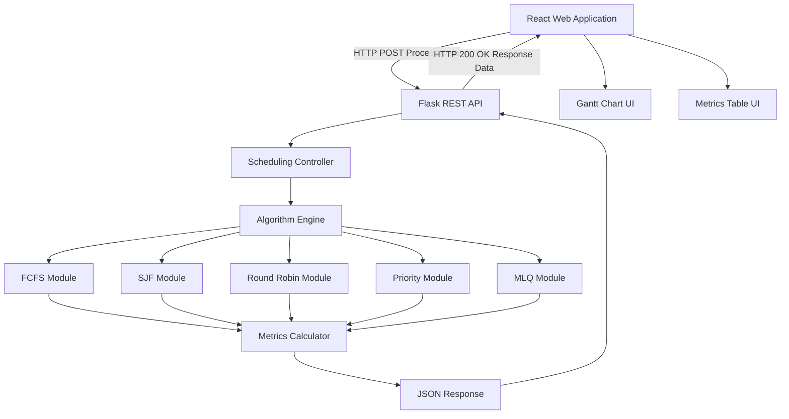
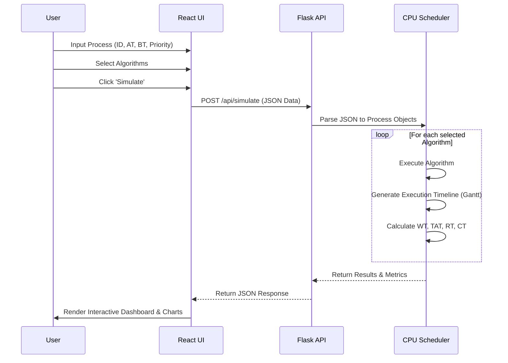
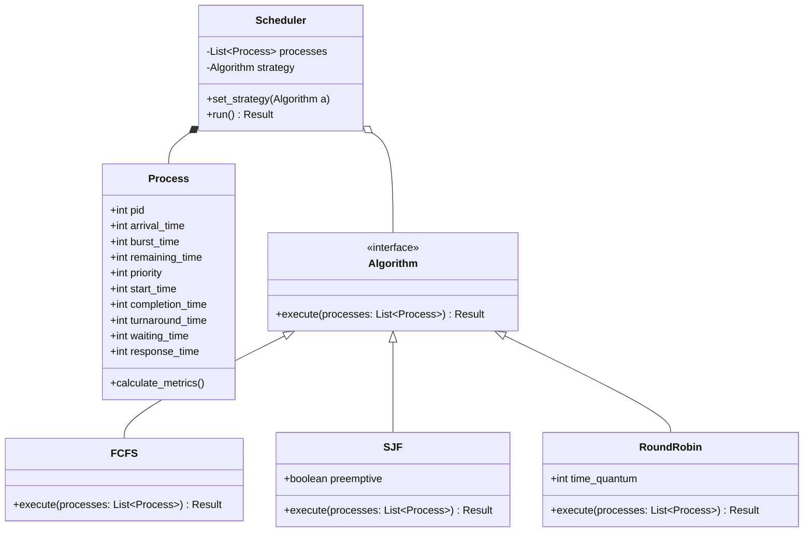

# Phase 2: System Design

This section covers the comprehensive architecture and design of the CPU Scheduling Simulation System.

## 1. System Architecture

The application is built using a modern **Client-Server Architecture**.
- **Frontend (Client)**: React.js application responsible for input collection and visual output rendering.
- **Backend (Server)**: Flask API (Python) responsible for algorithmic computation and result aggregation.

## 2. Data Flow Diagram

## 3. UML Class Diagram for Scheduler Engine

The backend core logic is object-oriented. The classes decouple the state of a process from the logic of an algorithm.

## 4. Module Description

1. **Process Module**: Contains the Data Structure representing an OS Process. Includes state variables like remaining burst time.
2. **Algorithm Engine Module**: Implements the Strategy Pattern. Each scheduling algorithm is a strategy that can be plugged into the context (Scheduler).
3. **Metrics Engine Module**: Calculates mathematical averages across all processes after simulation (e.g., Average TAT, Throughput).
4. **Visualization Module (Frontend)**: Uses React state management to map JSON output timelines to CSS/SVG-based Gantt charts.
